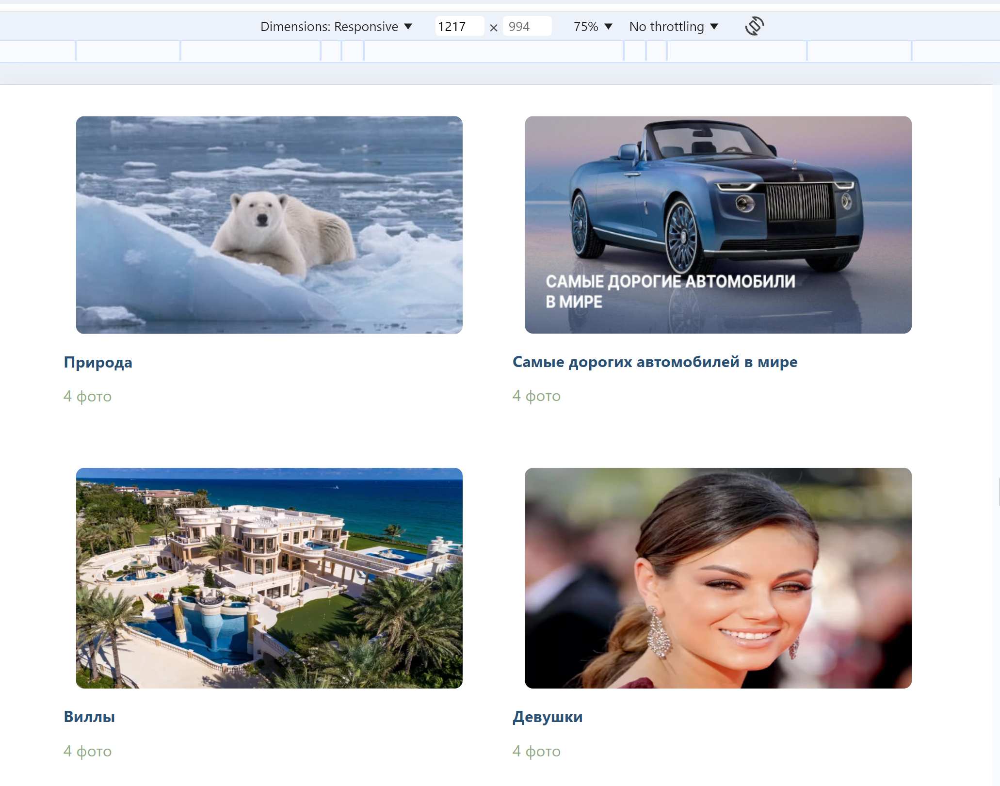
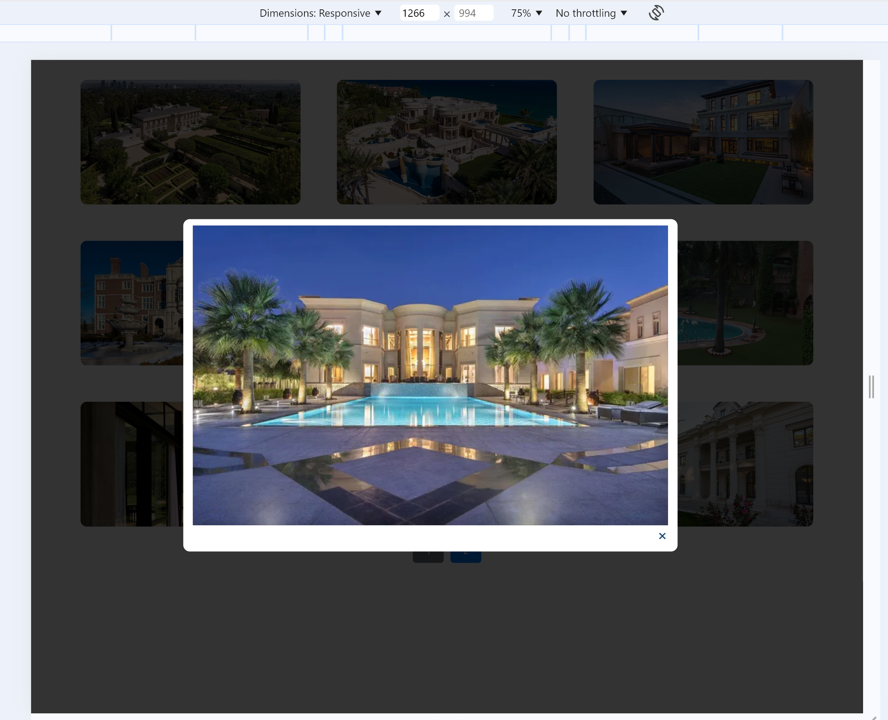

# CaseLabJavaScript
Тестовое задание для CaseLab JavaScript
Галерея пагинация и адаптивная верстка работают,
 при клике на фотографию открывается модальное окно.

## Admin login password
ADMIN_EMAIL: "admin@example.com"
ADMIN_PASSWORD: "d1r3ctu5"

### A. Описание выполнения работы
Разработано три ключевых компонента для управления и отображения фотогалереи: AlbumList, PhotoGallery, и Pagination. Эти компоненты работают в связке, используя MobX для эффективного управления состоянием и обновления данных.

AlbumList: Этот компонент представляет собой список альбомов, предоставляя пользователю удобный интерфейс для выбора интересующего альбома. Стиль компонента обеспечивает чёткое визуальное разделение между элементами, а также интуитивно понятное представление информации.

PhotoGallery: Основное пространство для просмотра фотографий выбранного альбома. Он предоставляет пользователю возможность наслаждаться изображениями в полном размере.

Pagination: Компонент пагинации обеспечивает удобное навигационное управление между различными страницами альбома или галереи. Стиль пагинации продуман таким образом, чтобы облегчить пользователю перемещение между страницами и улучшить общую навигацию.

Каждый из компонентов стилизован с учетом современных дизайнов и пользовательского опыта, а взаимодействие между ними происходит через MobX, который управляет состоянием и обновлениями данных, обеспечивая плавную и эффективную работу всего приложения.

#### B. Инструкция по запуску
cd gallery-react
docker build .
docker images
docker run -p 80:80 imagesID

cd ../
cd directus
docker-compose up -d

##### C. Скрины рабочего приложения 

